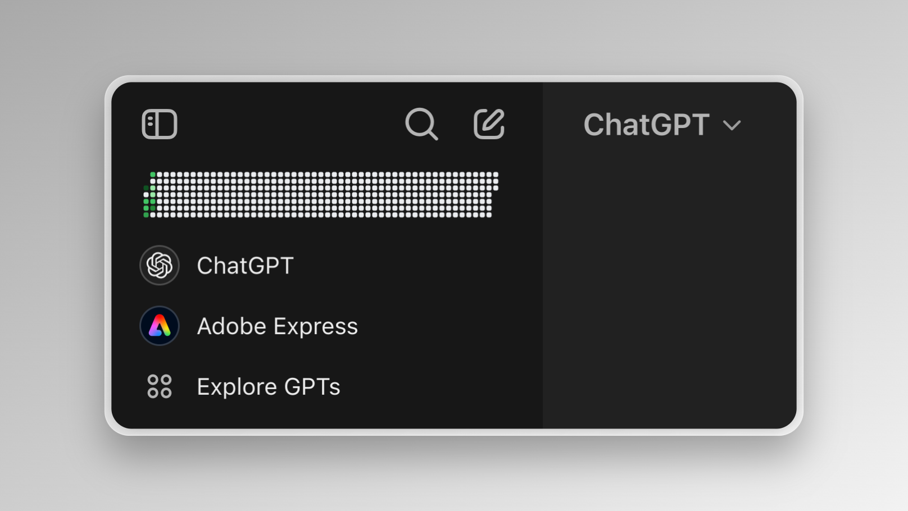

# ChatGPT Activity

A Chrome extension built with [Plasmo Framework](https://docs.plasmo.com/) that adds a GitHub-style contribution graph to your ChatGPT sidebar, showing your ChatGPT usage patterns over time. Track your AI interactions just like you track your code contributions!



## Features

- 📊 GitHub-style contribution heat map in your ChatGPT sidebar
- 📅 Visual representation of your ChatGPT usage across days and months
- 🎨 Color-coded intensity based on daily usage
- 📱 Responsive design that integrates seamlessly with ChatGPT's interface
- 🔍 Detailed view on hover showing exact usage counts
- 📈 Track your AI interaction patterns over time

## Installation

1. Clone this repository:

```bash
git clone https://github.com/yourusername/chatgpt-activity.git
cd chatgpt-activity
```

2. Install dependencies:

```bash
pnpm install
# or
npm install
```

3. Build the extension:

```bash
pnpm build
# or
npm run build
```

4. Load the extension in Chrome:
   - Open Chrome and navigate to `chrome://extensions/`
   - Enable "Developer mode" in the top right
   - Click "Load unpacked" and select the `build/chrome-mv3-dev` directory

## Development

To start the development server:

```bash
pnpm dev
# or
npm run dev
```

The extension will automatically reload when you make changes to the code.

## How It Works

The extension tracks your ChatGPT usage by monitoring your interactions with the platform. It stores this data locally and displays it in a contribution graph similar to GitHub's contribution chart. The data is visualized using a heat map where darker colors indicate more frequent usage.

## Privacy

All usage data is stored locally in your browser. No data is sent to external servers or shared with third parties.

## Contributing

Contributions are welcome! Please feel free to submit a Pull Request.

## License

[MIT License](LICENSE)

## Acknowledgments

Built with:

- [Plasmo Framework](https://docs.plasmo.com/)
- TypeScript
- React
